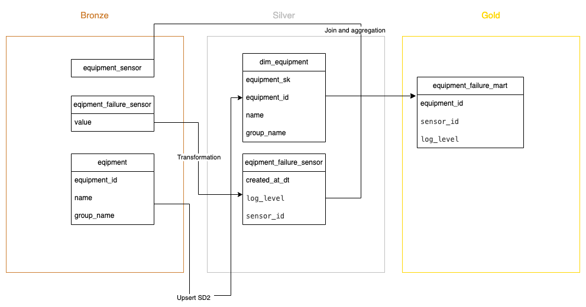

# Answer to Shape's Data Engineering Interview


This is a example of solution to Shape's Data Engineering Interview, i have tried to use a design pattern that simulate the environment with thres layes, Bronze (raw file), Silver and Gold. 
At first layer i saved the files almost original format, except by the format writing with delta table. 
The second layer was created a version of [SD2](https://decisionworks.com/2000/10/design-tip-15-combining-scd-techniques/) to dim_equipment table, this table is a way to track changes abount each equipment saving the history of updates on own table. At same layer was created a transformation under equipment_failure_sensors(log file) with target to split as well as to aply a schema.
At end, on gold table was done the join between these tres tables, dim_equipment, equipment_sensor and equipment_failure_sensors (log table) summarize by day. It's can be useful to answser the four tasks with simple querys.


## Architecture



## Sample of tables

### dim_equipment sample data 

```python
+--------------------------------+------------+--------+----------+--------------------------+-------+--------------------------+-------------------+
|equipment_sk                    |equipment_id|name    |group_name|updated_at_dt             |current|valid_from                |valid_to           |
+--------------------------------+------------+--------+----------+--------------------------+-------+--------------------------+-------------------+
|417c76c1d21982f98e514d8b733e1283|7           |E54B5C3A|FGHQWR2Q  |2023-12-16 23:12:49.471118|true   |2023-12-16 23:12:49.471118|2099-01-01 12:00:00|
|ffdd6dd94a838a9ec67406ee920a0b52|11          |09C37FB8|PA92NCXZ  |2023-12-16 23:12:49.471118|true   |2023-12-16 23:12:49.471118|2099-01-01 12:00:00|
|bb668587c589c1b896f864ea2389468d|3           |E1AD07D4|FGHQWR2Q  |2023-12-16 23:12:49.471118|true   |2023-12-16 23:12:49.471118|2099-01-01 12:00:00|
|a7347e68a1906e2ce03862193a4450a5|8           |86083278|NQWPA8D3  |2023-12-16 23:12:49.471118|true   |2023-12-16 23:12:49.471118|2099-01-01 12:00:00|
|2c644baa88b27c8c385d0a7d64c691f9|5           |78FFAD0C|9N127Z5P  |2023-12-16 23:12:49.471118|true   |2023-12-16 23:12:49.471118|2099-01-01 12:00:00|
|f7b5db7f2cc9186add2566e25463e9a0|6           |9AD15F7E|PA92NCXZ  |2023-12-16 23:12:49.471118|true   |2023-12-16 23:12:49.471118|2099-01-01 12:00:00|
|cd10d0fb12aafe75ef583d20125f9204|9           |3329175B|VAPQY59S  |2023-12-16 23:12:49.471118|true   |2023-12-16 23:12:49.471118|2099-01-01 12:00:00|
|818113697aa105494dbc9488ffcab836|1           |5310B9D7|FGHQWR2Q  |2023-12-16 23:12:49.471118|true   |2023-12-16 23:12:49.471118|2099-01-01 12:00:00|
|10188ffad5e920e4db766be7ba61e814|10          |98B84035|NQWPA8D3  |2023-12-16 23:12:49.471118|true   |2023-12-16 23:12:49.471118|2099-01-01 12:00:00|
|c79cb58cff895499986c9906e7476e8e|4           |ADE40E7F|9N127Z5P  |2023-12-16 23:12:49.471118|true   |2023-12-16 23:12:49.471118|2099-01-01 12:00:00|
|92774c996029766dcc562a8c61e6d602|12          |CF304D24|FGHQWR2Q  |2023-12-16 23:12:49.471118|true   |2023-12-16 23:12:49.471118|2099-01-01 12:00:00|
|c271343b945b1a95d5f6825a915940fc|13          |4E834E81|Z9K1SAP4  |2023-12-16 23:12:49.471118|true   |2023-12-16 23:12:49.471118|2099-01-01 12:00:00|
|2aeed367f05d0bb5d512a5e56fc29988|14          |2C195700|VAPQY59S  |2023-12-16 23:12:49.471118|true   |2023-12-16 23:12:49.471118|2099-01-01 12:00:00|
|71c765dfee1d1a54ea427087d1883cc8|2           |43B81579|VAPQY59S  |2023-12-16 23:12:49.471118|true   |2023-12-16 23:12:49.471118|2099-01-01 12:00:00|
+--------------------------------+------------+--------+----------+--------------------------+-------+--------------------------+-------------------+
```

### equipment_failure_mart sample data 
```python

+------------+---------+---------+-------------+--------------+----------+-----+---------------+-------------+--------------------+----------+
|equipment_id|sensor_id|log_level|created_at_dt|equipment_name|group_name|count|avg_temperature|avg_vibration|        etl_inserted| partition|
+------------+---------+---------+-------------+--------------+----------+-----+---------------+-------------+--------------------+----------+
|          12|     8124|    ERROR|   2021-10-03|      CF304D24|  FGHQWR2Q|    2|         274.23|      7616.05|2023-12-17 00:19:...|2023-12-16|
|          12|      859|    ERROR|   2019-07-27|      CF304D24|  FGHQWR2Q|    1|         476.69|      8865.09|2023-12-17 00:19:...|2023-12-16|
|           2|     7962|    ERROR|   2019-05-09|      43B81579|  VAPQY59S|    3|         208.74|     -1184.19|2023-12-17 00:19:...|2023-12-16|
|           6|     3540|    ERROR|   2020-09-12|      9AD15F7E|  PA92NCXZ|    2|         298.73|     -5195.91|2023-12-17 00:19:...|2023-12-16|
|          14|     6735|    ERROR|   2019-06-09|      2C195700|  VAPQY59S|    1|         181.44|     -7821.52|2023-12-17 00:19:...|2023-12-16|
|           6|     8794|    ERROR|   2019-07-04|      9AD15F7E|  PA92NCXZ|    1|         388.50|      3335.25|2023-12-17 00:19:...|2023-12-16|
|           9|     2503|    ERROR|   2019-11-23|      3329175B|  VAPQY59S|    2|         265.51|     -7548.10|2023-12-17 00:19:...|2023-12-16|
|           8|     5807|    ERROR|   2019-05-24|      86083278|  NQWPA8D3|    1|         144.72|     -1660.66|2023-12-17 00:19:...|2023-12-16|
|           7|     5346|    ERROR|   2019-12-13|      E54B5C3A|  FGHQWR2Q|    2|         443.92|      2373.67|2023-12-17 00:19:...|2023-12-16|
|          11|     2174|    ERROR|   2020-03-11|      09C37FB8|  PA92NCXZ|    1|          50.55|      -387.11|2023-12-17 00:19:...|2023-12-16|
|           8|     8357|    ERROR|   2019-12-20|      86083278|  NQWPA8D3|    2|         493.34|     -2604.34|2023-12-17 00:19:...|2023-12-16|
|          14|     6197|    ERROR|   2020-01-06|      2C195700|  VAPQY59S|    1|         251.17|     -9064.35|2023-12-17 00:19:...|2023-12-16|
|          12|     6903|    ERROR|   2021-02-16|      CF304D24|  FGHQWR2Q|    1|         105.67|      7555.75|2023-12-17 00:19:...|2023-12-16|
|           6|     8481|    ERROR|   2020-03-13|      9AD15F7E|  PA92NCXZ|    3|          48.18|      1038.86|2023-12-17 00:19:...|2023-12-16|
|           5|     5708|    ERROR|   2020-08-09|      78FFAD0C|  9N127Z5P|    1|         144.48|     -8376.58|2023-12-17 00:19:...|2023-12-16|
|           2|     5347|    ERROR|   2019-12-04|      43B81579|  VAPQY59S|    1|         216.62|      9474.55|2023-12-17 00:19:...|2023-12-16|
|          13|     5482|    ERROR|   2021-09-15|      4E834E81|  Z9K1SAP4|    1|          23.34|     -4652.20|2023-12-17 00:19:...|2023-12-16|
|          14|      114|  WARNING|   2019-02-15|      2C195700|  VAPQY59S|    1|         347.95|     -2122.69|2023-12-17 00:19:...|2023-12-16|
|           5|     7487|    ERROR|   2019-05-02|      78FFAD0C|  9N127Z5P|    1|         312.70|      2794.17|2023-12-17 00:19:...|2023-12-16|
|           7|     5827|    ERROR|   2019-03-15|      E54B5C3A|  FGHQWR2Q|    1|          73.05|     -5415.20|2023-12-17 00:19:...|2023-12-16|
+------------+---------+---------+-------------+--------------+----------+-----+---------------+-------------+--------------------+----------+

```

## Answers

> [!WARNING] 
> It Was considered WARNING AND ERROR as failures

1. How much the Total equipment failures that happened?

If we count the warnings as failure  the total was 5000001

```sql
    select
        sum(count),
        log_level
    from equipment.equipment_failure_mart
    group by log_level

+----------+---------+                                                          
|sum(count)|log_level|
+----------+---------+
|   4749475|    ERROR|
|    250526|  WARNING|
```
2. Which equipment name had most failures?

aws:  equipment: 98B84035

```sql
    select
        equipment_name,
        sum(count)
    from equipment.equipment_failure_mart
    group by equipment_name
    order by sum(count) desc

+--------------+----------+                                                     
|equipment_name|sum(count)|
+--------------+----------+
|      98B84035|    358414|
|      09C37FB8|    357701|
|      E1AD07D4|    357627|
|      ADE40E7F|    357618|
|      4E834E81|    357528|
|      78FFAD0C|    357521|
|      2C195700|    357229|
|      5310B9D7|    357220|
|      CF304D24|    357179|
|      86083278|    356855|
|      43B81579|    356846|
|      3329175B|    356736|
|      9AD15F7E|    356084|
|      E54B5C3A|    355443|
+--------------+----------+
```
3. Average amount of failures across equipment group, ordered by the number of failures in ascending order?

Average by year, month day ? the total across equipment group is:

```sql
    select
        group_name,
        avg(count) sum_failures
    from equipment.equipment_failure_mart  
    group by group_name
    order by sum(count) asc

+----------+------------+                                                       
|group_name|sum_failures|
+----------+------------+
|  Z9K1SAP4|      357528|
|  PA92NCXZ|      713785|
|  9N127Z5P|      715139|
|  NQWPA8D3|      715269|
|  VAPQY59S|     1070811|
|  FGHQWR2Q|     1427469|
+----------+------------+

```
Average by sensor's amount

```sql
        select
            group_name,
            sum(count)/count(distinct sensor_id) avg_by_qty_sensor
        from equipment.equipment_failure_mart  
        group by group_name
        order by sum(count)/count(distinct sensor_id) asc

+----------+------------------+                                                 
|group_name| avg_by_qty_sensor|
+----------+------------------+
|  FGHQWR2Q|499.46431070678796|
|  VAPQY59S| 499.6784881007933|
|  PA92NCXZ|499.84943977591035|
|  9N127Z5P| 500.4471658502449|
|  Z9K1SAP4|500.73949579831935|
|  NQWPA8D3| 500.8886554621849|
+----------+------------------+

```


4. Rank the sensors which present the most number of errors by equipment name in an equipment group.

```sql
    select
        equipment_name,
        group_name,
        sensor_id,
        sum(count)
    from equipment.equipment_failure_mart
    group by equipment_name, group_name, sensor_id
    order by sum(count) desc
    limit 10


+--------------+----------+---------+----------+                                
|equipment_name|group_name|sensor_id|sum(count)|
+--------------+----------+---------+----------+
|      E1AD07D4|  FGHQWR2Q|     9349|       604|
|      98B84035|  NQWPA8D3|     4990|       582|
|      98B84035|  NQWPA8D3|     9777|       582|
|      43B81579|  VAPQY59S|     1127|       580|
|      5310B9D7|  FGHQWR2Q|     7150|       579|
|      09C37FB8|  PA92NCXZ|     9400|       577|
|      2C195700|  VAPQY59S|     7966|       575|
|      5310B9D7|  FGHQWR2Q|     8917|       574|
|      09C37FB8|  PA92NCXZ|     1358|       573|
|      4E834E81|  Z9K1SAP4|     6639|       573|
+--------------+----------+---------+----------+
```

## installation

For to build and run the two service just run the code bellow:

```shell
    docker-compose up -d 
```
### tests

For running the tests, execute:

```shell
    make pytest
```

### ETL

For running the etl, execute:

```shell
    make etl
```

### DDL

For running the ddl query, execute:

```shell
    make create_tables
```

### Spark interative

For running the spark interative query, execute:

```shell
    make spark-sh
```